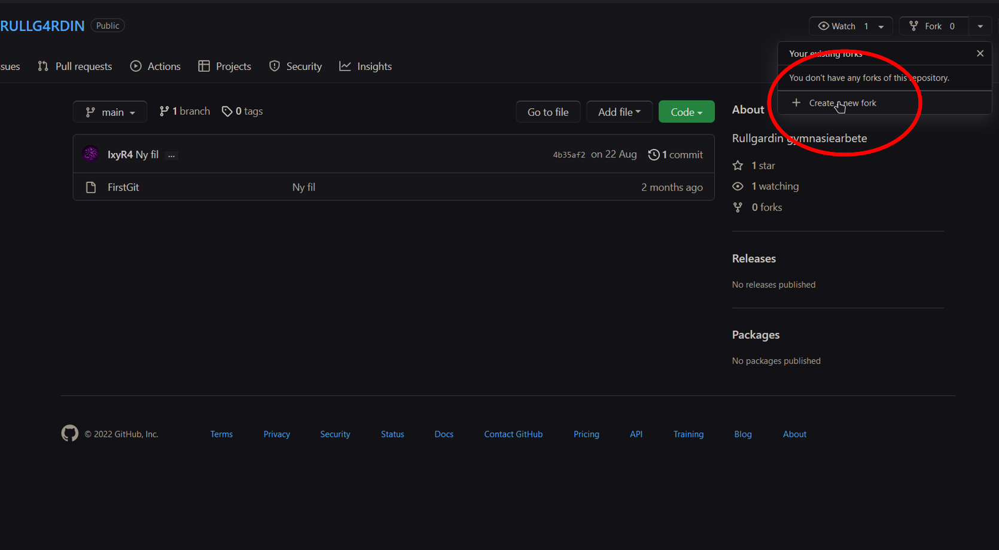
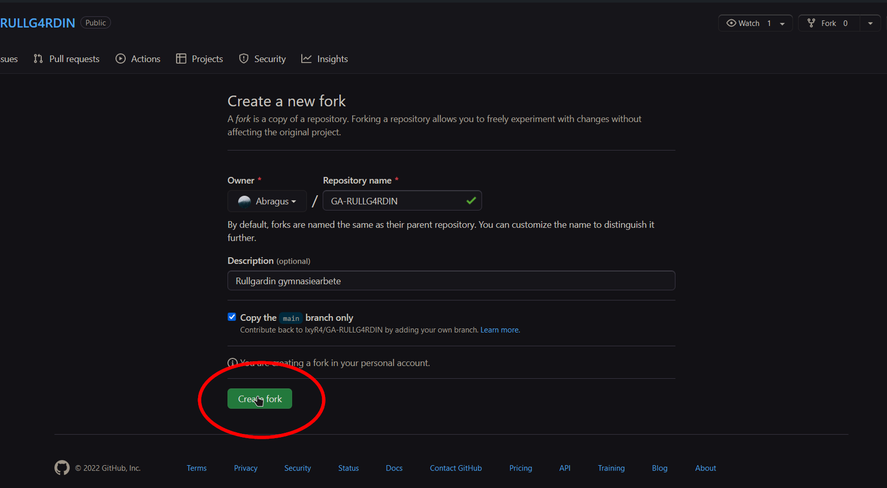

# Rullgardin Gymnasiearbete

Nu jävlar ska det programmeras 

>Ifall någon som inte har använt Git tidigare får för sig att göra det nu (gör det), så sammanställde jag lite instruktioner till hur det fungerar. Om inte så finns det i alla fall om det skulle behövas. 
>
>Lär ha missat något också. 
>
>/Gustav

## Vad är Git?

Git är det kommando-verktyg som används för att prata med GitHub. Det har smart versionshantering, som gör att vi alla kan jobba på olika saker på olika håll, och sedan utan problem (förhoppningsvis) föra ihop ändringarna automatiskt. Även om vi ändrat i samma fil. 

Nedan finns lite instruktioner för hur man använder Git, och några av de vanligaste kommandona, men som sagt lär jag ha missat en del. 

## Installera Git

1. Installera Git for Windows: https://gitforwindows.org/

2. Öppna Git Bash (OBS! Detta funkar **inte** i vanliga CMD!)

3. ???

4. Git-ta

## Skapa din fork

En fork är en egen kopia av denna GitHuben, där man kan göra ändringar utan att påverka den "riktiga" versionen, för att sedan föra samman dem (merge) när ändringarna är klara. 

Skapa den så här: 

## Hur man jobbar med Git

### 1.1 `git clone https://github.com/<ditt_namn>/GA-RULLG4RDIN` (Endast första gången)

Ladda ner Giten från GitHub. Använd länken till din egna fork. 

Skapar en ny mapp i nuvarande directoryt med alla filer.  
Öppna den med `cd GA-RULLGARDIN`

### 1.2 `git pull` (Alltid utom första gången.)

Ladda ner de senaste ändringarna från GitHub. 

### 2. Gör ändringar

Lägg till ny kod, whatever. 

### 3. `git add <filnamn>`

Lägg till nya eller ändrade filer i Git. 

### 4. `git ci -m "<commitmeddelande>"`

Skapa ny commit (förkortning 'ci'). När du är färdig med ändringarna kan du skapa en ny commit (en ändring, en uppdatering).  
Commitmeddelande är beskrivning vad man ändrat (engelska tack), typ 'Add possibility of \[nånting]'

### 5. `git push origin main`

Ladda upp lokala commits till din fork i GitHub.

### 6. Skapa en <a href="https://github.com/IxyR4/GA-RULLG4RDIN/pulls" target="_blank">pull-request</a>

Tryck 'New pull request' i den riktiga GitHuben, och välj din fork. Här kan du se skillnader mellan versionerna, och om det går att mergea dem automatiskt.  
Även här går att lägga en kommentar med förklaring, gör gärna det med kanske. 

Gör hellre flera mindre commits än få och stora, och skriv tydliga meddelanden. Då blir det lättare att lösa problem om de uppstår. 

## Bash- och Git-kommandon

### `ls` 

Visa innehåll i nuvarande mappen (directoryt) 

För att visa innehåll i \<mappnamn>: `ls <mappnamn>` 

Sökvägen till nuvarande directory står i command-prompten. 

### `cd <mappnamn>`

Change directory  
Navigerar mellan mappar, som i filhanteraren. 

Gå upp en mapp: `cd ..`  
Öppna en mapp: `cd <mappnamn>`  
Fungerar även med hela filsökvägen, t.ex: `cd ~/Documents/GA-RULLG4RDIN`  
~ är samma sak som /c/users/\<namn>/  

### `code <filnamn>`

Med Visual Studio Code installerat, öppna en existerande fil eller skapa en ny i nuvarande mappen. 

### `git help`

Visa alla kommandon med förklaring.  
`git <kommando> -h` för hjälp med specifikt kommando.  

Hjälpkommandot bör räcka som förklaring om man är smart, men här är de viktigaste verktygen: 

### `git clone https://github.com/<ditt_namn>/GA-RULLG4RDIN`

Ladda ner Giten från GitHub. Skapar en ny mapp i nuvarande directoryt med alla filer. 

### `git pull`

Ladda ner de senaste ändringarna från GitHub. 

### `git st`

Förkortning av `git status`  
Visa information om nuvarande status i Git. Vilka filer som är nya eller redigerade, vilka som kommer med i nästa commit, och annat. 

### `git add <filnamn>`

Lägg till nya eller ändrade filer i Git. 

### `git mv <gammal_filsökväg> <ny_filsökväg>`

Flytta fil. T.ex:  
`git mv fil.txt /../mapp/ny_fil.txt` (Kommer flytta filen ett steg upp (..) från nuvarande mappen, och lägga den i mappen med namnet 'mapp' med namnet 'ny_fil')

Används även för att byta namn på en fil. 

### `cp <gammal_filsökväg> <ny_filsökväg>`

Kopiera fil.

### `git rm`

Ta bort fil (både från Git och på riktigt).

### `git ci -m "<commitmeddelande>"`

Skapa en ny commit (en ändring, eller en uppdatering).  
Commitmeddelande är beskrivning vad man ändrat (engelska tack), typ 'Add possibility of \[nånting]'

### `git push origin main`

Ladda upp lokala commits till GitHub.  